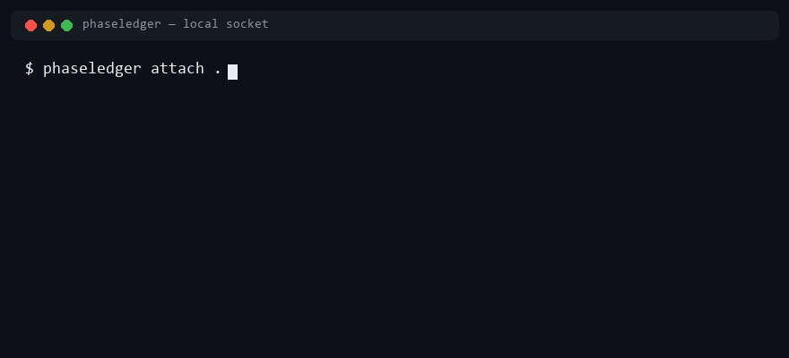
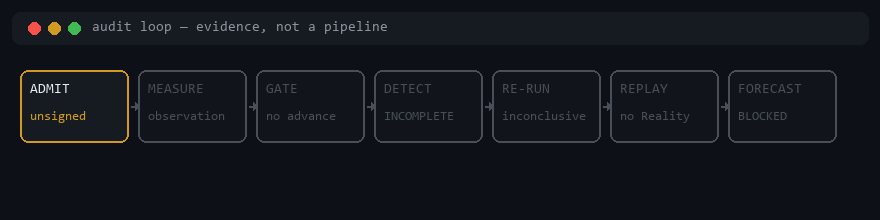
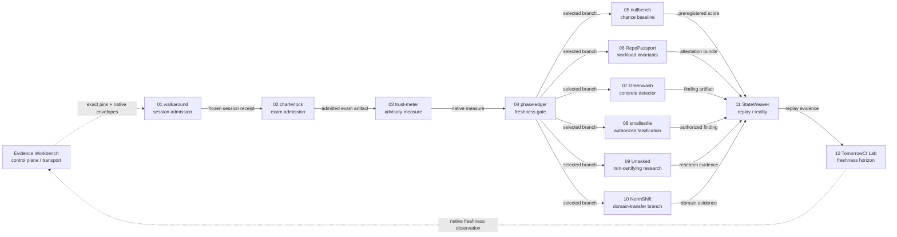

# Nelson Stack

> **AI safety audit · local-first tooling · evidence-backed engineering.**
> The connective tissue across the repos Nelson ships under
> [`taipei49314`](https://github.com/taipei49314).

This is not a portfolio. Each repo here earns its place by either (a) implementing
a piece of the AI-safety-audit stack, or (b) being the tool the audit stack
itself was built with. Nothing ships here that a reproducible harness has not
produced on a clean checkout. Nothing claims a status it has not held under
that harness.

---

## What this repo is

A **living index**. Not a monorepo. Not a curated list. It exists so that the
relationship between the linked project repos is legible in one read, and
so that anyone auditing Nelson's work can navigate from the principles down to
the evidence in one pass.

Last reconciled against GitHub repository, archive, release, and CI metadata:
**2026-08-15**.

The headline principle across everything here:

> **Declarations are not evidence. The workload does not judge itself. Models
> may propose; only the verifier decides. `UNKNOWN` / `INCOMPLETE` is better
> than a false pass.**

That sentence is from
[`RepoPassport`](https://github.com/taipei49314/RepoPassport). It is also the
operating principle of every other repo on this page.

---

## The core: AI safety audit

Nelson's primary research target is **how to audit an AI-driven system in a way
that the system itself cannot fake**. Claims are not trusted until measured.
The active front of the stack is therefore admission, then measurement: refuse
a session that never entered a frozen contract, refuse a journey the examinee
wrote, score the checkout, refuse unmeasured phase advances, then run the six
audit questions.

| # | Audit question | Primary repo | Supporting repos |
|---|---|---|---|
| 00 | Did this session **enter** a frozen task contract? | [`walkaround`](https://github.com/taipei49314/walkaround) | — |
| 00b | Was the journey allowed to count as an **exam**? | [`charterlock`](https://github.com/taipei49314/charterlock) | [`RepoPassport`](https://github.com/taipei49314/RepoPassport) (declared journey); [`unasked`](https://github.com/taipei49314/unasked) (who may say verified) |
| 0 | What does the checkout **score** from local evidence? | [`trust-meter`](https://github.com/taipei49314/trust-meter) | [`phaseledger`](https://github.com/taipei49314/phaseledger) (fresh `PASS` required to advance) |
| 0b | Can this phase **advance** without a measurer verdict? | [`phaseledger`](https://github.com/taipei49314/phaseledger) | [`trust-meter`](https://github.com/taipei49314/trust-meter) |
| 0c | Did a pre-registered decision **beat chance**? | [`nullbench`](https://github.com/taipei49314/nullbench) | [`branchback`](https://github.com/taipei49314/branchback) (belief-at-the-time replay) |
| 1 | Did the declared journey **work**? | [`RepoPassport`](https://github.com/taipei49314/RepoPassport) | [`unasked`](https://github.com/taipei49314/unasked) (non-certifying investigation) |
| 2 | Did the workload stay within its declared **capabilities**? | [`RepoPassport`](https://github.com/taipei49314/RepoPassport) | [`nelsoncode-ide`](https://github.com/taipei49314/nelsoncode-ide) (capability token bridge) |
| 3 | Was the result **reproducible**? | [`stateweaver`](https://github.com/taipei49314/stateweaver) | [`RepoPassport`](https://github.com/taipei49314/RepoPassport) (deterministic plans) |
| 4 | Was **cleanup** complete? | [`RepoPassport`](https://github.com/taipei49314/RepoPassport) | [`stateweaver`](https://github.com/taipei49314/stateweaver) (reality replay) |
| 5 | What **evidence** exists, and who signed it? | [`stateweaver`](https://github.com/taipei49314/stateweaver) | [`RepoPassport`](https://github.com/taipei49314/RepoPassport) (attestation bundles) |
| 6 | Is that evidence still **current**? | [`tomorrowci`](https://github.com/taipei49314/tomorrowci) · [`tomorrowci-lab`](https://github.com/taipei49314/tomorrowci-lab) | [`RepoPassport`](https://github.com/taipei49314/RepoPassport) (verdict staleness) |

`walkaround` and `charterlock` sit in front of measurement. `walkaround` asks
whether the session entered a frozen contract — done without entry is
`BYPASSED`; a receipt is not a verification of the work. `charterlock` asks
whether that journey was allowed to be the exam — same key writing and sitting
it is `CHARTER_COLLAPSED`; two MAC keys do not prove two people.
`trust-meter` and `phaseledger` then score first and advance only on a fresh
deterministic `PASS`. `nullbench` asks whether a pre-registered decision beat
chance without backfill. `RepoPassport` answers questions 1, 2, and 4 — the
*workload-side* invariants. `stateweaver` answers questions 3 and 5 — the
*verifier-side* invariants. `tomorrowci` answers question 6 — *will this
evidence still be valid tomorrow?*

### Evidence Workbench: control plane, not authority

[`evidence-workbench`](https://github.com/taipei49314/evidence-workbench) is the
authority-preserving control plane plus artifact/execution shell that catalogs
the twelve active cells below. It pins source and runtime candidates, imports
exact artifacts, records native envelopes, and executes only separately
admitted operations whose required boundary is implemented. EWB itself is not
globally read-only. The NelsonCode integration is a deliberately read-only
bridge limited to catalog observations. Exact bytes and digests move between
cells only through separately admitted handoffs; registry presence alone does
not perform a handoff. EWB does **not** certify a workload, reinterpret a native
status, or synthesize an aggregate `PASS`.

An arrow means “the next cell may independently admit this exact artifact.” It
does not claim that bytes have already moved, that the upstream cell granted
authority to the downstream one, or that every investigation must pass through
one linear pipeline.

The workbench registry is allowed to be ahead of execution. A pinned cell whose
interpreter, dependency closure, authorization contract, or containment is not
bound remains `fail_closed`; catalog visibility is not execution readiness.

### A worked example

Suppose an agent says done, writes its own exam, then makes CI green by
weakening a test. The audit chain is:

1. [`walkaround`](https://github.com/taipei49314/walkaround) **admits the
   session** only if it entered a frozen contract. Done without entry is
   `BYPASSED`. A receipt is unsigned at M4 and is not a verification of the
   work.
2. [`charterlock`](https://github.com/taipei49314/charterlock) **refuses the
   exam** if the same key wrote and sat it (`CHARTER_COLLAPSED`) or if the
   subject's `must` set is a proper subset of the charter
   (`CHARTER_NARROWED`).
3. [`trust-meter`](https://github.com/taipei49314/trust-meter) **scores** the
   checkout from local evidence. [`phaseledger`](https://github.com/taipei49314/phaseledger)
   **refuses** a phase advance unless that measure is a fresh `PASS`.
4. [`greenwash`](https://github.com/taipei49314/greenwash) **detects** the
   tampering at the diff level — assertion strength weakened, golden file
   rewritten, CI runner script quieted. Zero LLM, zero network, byte-identical
   verdict.
5. [`RepoPassport`](https://github.com/taipei49314/RepoPassport) **re-runs the
   declared scenario** in a sandbox where the workload cannot self-judge, and
   produces a structured verdict (functional / capability / cleanup).
6. [`stateweaver`](https://github.com/taipei49314/stateweaver) **replays the
   finding** against a clean root and demands the patched build blocks the
   same path; only then does `SYNTHETIC_REPRODUCED` advance.
7. [`tomorrowci`](https://github.com/taipei49314/tomorrowci) **forecasts** the
   earliest concrete breakage horizon — the moment the patched build's
   dependencies or runtime stop supporting the verification path.

A finding that survives the chain is publishable. Any stage that fails
must be re-run from the previous stage's clean root. `smallestlie` is the
authorized adversarial complement: find the smallest lie the repo still
accepts. `nullbench` is the chance-baseline complement: pre-register the
claim, then score it against chance — never backfill.

---

## Repo map

Every repo is pre-alpha or pre-release unless otherwise noted. Status badges
on each repo are authoritative; this map is secondary.

“Active indexed project repos” means public repositories owned by
[`taipei49314`](https://github.com/taipei49314) that are explicitly listed in
this map and whose GitHub `isArchived` flag is false. The count excludes this
`nelson-stack` index and the `taipei49314` profile repository. The map currently
contains 30 active projects plus one archived historical prototype; together
with those two meta repositories, that reconciles to all 33 public owner repos.

### Audit stack (the core)

| Repo | Language | Role in the stack |
|---|---|---|
| [`walkaround`](https://github.com/taipei49314/walkaround) | Python | Session admission kernel. Done without entry is `BYPASSED`. No release; receipts unsigned; no `VERIFIED`. |
| [`charterlock`](https://github.com/taipei49314/charterlock) | Python | Exam-admission measurer. Same key writing and sitting the exam is `CHARTER_COLLAPSED`. No release; `independence_claim` is always `not_claimed`. |
| [`trust-meter`](https://github.com/taipei49314/trust-meter) | Python | Measure-first scorer. No release; claims are not trusted until measured. |
| [`phaseledger`](https://github.com/taipei49314/phaseledger) | Python | Phase ledger. Advance only on a fresh deterministic measurer `PASS`. |
| [`nullbench`](https://github.com/taipei49314/nullbench) | Python | Pre-register decisions; score against chance; never backfill. GitHub Latest: [`v0.7.0`](https://github.com/taipei49314/nullbench/releases/tag/v0.7.0). |
| [`RepoPassport`](https://github.com/taipei49314/RepoPassport) | Go | Workload-side audit: capabilities, cleanup, attestation bundles. Working `v1alpha1` slice; 37-row acceptance registry is machine-checked; observer coverage remains incomplete. No release. |
| [`stateweaver`](https://github.com/taipei49314/stateweaver) | Python | Verifier-side audit: deterministic replays, oracle verdicts, signed evidence. Source-only pre-alpha; M6–M8 implementation gates exist; trusted Reality proof is not claimed. No release. |
| [`tomorrowci`](https://github.com/taipei49314/tomorrowci) · [`tomorrowci-lab`](https://github.com/taipei49314/tomorrowci-lab) | Rust · Python | Time-side audit: dependency / runtime breakage forecasting. Newest lab prerelease: [`v0.2.0-alpha.1`](https://github.com/taipei49314/tomorrowci-lab/releases/tag/v0.2.0-alpha.1) (`CANDIDATE_ONLY_NOT_RELEASE_AUTHORIZED`). GitHub “Latest” on both still points at rejected [`v0.1.0-grok-session`](https://github.com/taipei49314/tomorrowci-lab/releases/tag/v0.1.0-grok-session). |
| [`greenwash`](https://github.com/taipei49314/greenwash) | Python | Diff-level detector for AI agent tampering with verification layers. GitHub Latest: [`v0.1.41`](https://github.com/taipei49314/greenwash/releases/tag/v0.1.41). At the 2026-08-15 reconciliation, `main` was one README-only Action-pin commit ahead of that tag. |
| [`unasked`](https://github.com/taipei49314/unasked) | Python | Evidence-gated repository investigation; non-certifying alpha. GitHub Latest: [`v0.4.0`](https://github.com/taipei49314/unasked/releases/tag/v0.4.0). Public result remains `M0_NOT_DEMONSTRATED`. |
| [`smallestlie`](https://github.com/taipei49314/smallestlie) | Python | Authorized adversarial harness: smallest lie a repo still accepts. |
| [`branchback`](https://github.com/taipei49314/branchback) | TypeScript | Local-first decision replay lab — belief-at-the-time vs knowledge-now. [`v2.0.0`](https://github.com/taipei49314/branchback/releases/tag/v2.0.0). |
| [`constraint-deck`](https://github.com/taipei49314/constraint-deck) | Python | Session-first authorial constraint deck; measure first; contract over vibes. |
| [`persona-consistency-checker`](https://github.com/taipei49314/persona-consistency-checker) | Python | **Archived historical prototype.** PersonaChain experiments for persona drift under adversarial prompts. |
| [`null-city`](https://github.com/taipei49314/null-city) | TypeScript | Deterministic, partially observable crisis-response sandbox for agent eval. |
| [`NormShift`](https://github.com/taipei49314/NormShift) | Python | Evidence-backed semantic diff for technical standards (M0 local HTML slice). |

### Local-first tools (the substrate)

| Repo | Language | What it does |
|---|---|---|
| [`evidence-workbench`](https://github.com/taipei49314/evidence-workbench) | Rust | Authority-preserving control plane: exact pins, native envelopes, and fail-closed artifact transport. Not a verifier and not an aggregate judge. |
| [`nelsoncode-ide`](https://github.com/taipei49314/nelsoncode-ide) | TypeScript / Electron | Personal AI coding IDE; timeline as backbone; reversible sessions. Powers the audit loop locally. |
| [`md-brain`](https://github.com/taipei49314/md-brain) | Python | Model-independent continuity runtime for AI memory. |
| [`github-radar`](https://github.com/taipei49314/github-radar) | Python | GitHub research with measured uncertainty; can submit hashed findings to Frontier Atlas. |
| [`receiptradar`](https://github.com/taipei49314/receiptradar) | Rust | Local receipt → ledger CLI. No cloud, no account. |
| [`nelson-release-studio`](https://github.com/taipei49314/nelson-release-studio) | Python | Music creation, asset management, and release workbench — Windows-first. |
| [`music-lab`](https://github.com/taipei49314/music-lab) | Python | Deterministic local music toolkit; analysis first; no cloud account. |
| [`tw-stock-lab`](https://github.com/taipei49314/tw-stock-lab) | Python | Active local TW stock research lab ([`v0.2.0`](https://github.com/taipei49314/tw-stock-lab/releases/tag/v0.2.0)). *Research simulation, not investment advice.* |
| [`aurora`](https://github.com/taipei49314/aurora) | Python | Finds unnamed industries from evidence — deterministic, no LLM at runtime, no stock tips. |
| [`FutureShow-pet`](https://github.com/taipei49314/FutureShow-pet) | Python | Personal fork of HKUDS/FutureShow: local desktop pet (Taiwan news + GitHub AI-repo tracker) on Ollama / Qwen. |
| [`universe-explorer`](https://github.com/taipei49314/universe-explorer) | Python | Epistemically honest science knowledge system — separates known from unknown. |
| [`why-ledger`](https://github.com/taipei49314/why-ledger) | Docs | Why Ledger / 依據本 — justified sovereign decisions (WJSD). Documentation-first. |
| [`editorial-doll-engineering-preview`](https://github.com/taipei49314/editorial-doll-engineering-preview) | TypeScript | Public M0–M3 engineering preview of a deterministic editorial styling engine. |
| [`vibe-oracle`](https://github.com/taipei49314/vibe-oracle) | TypeScript | **Explicit anti-evidence foil.** Admits the theater; pure vibe, not evidence. |

---

## Operating principles

These are not aspirations. Every repo in the stack has been measured against
them on a clean checkout, and the failures are kept in the repo as evidence
(`FAILURES.md`, `benchmarks/decoy/`, `CYCLE*-VERDICT.md`, etc.).

1. **Deterministic over LLM-judged.** Whenever a verdict can be reached by
   deterministic analysis of the diff, the artifact, or the replay, it is.
   LLM judges are advisory.
2. **Measured, not asserted.** Every headline number — false-positive rate,
   detection count, replay latency — comes out of a reproducible harness.
   Nothing is hand-typed into a README.
3. **Honest about out-of-sample.** The detectors and verifiers in this stack
   are reported to perform worse on corpora they have never seen. That
   degradation is published, not hidden.
4. **Fail-closed by default.** A missing observation is `incomplete`. A
   capability violation outranks a functional pass. A signature without a
   trust key is `unknown`, not `valid`.
5. **Local-first, zero network.** Tools in this stack run on the operator's
   hardware. The audit trail does not phone home.
6. **Trust boundaries written into the repo.** `SECURITY.md`, `AGENTS.md`,
   `ABUSE_POLICY.md`, `THREATMODEL.md`, and traceability matrices are not
   optional. They are part of the deliverable.
7. **Verdicts are immutable history.** A `VERDICT.md` file is rewritten only
   by a later cycle that explicitly supersedes it. Earlier verdicts are kept
   so the next reader can see the dead ends.

---

## Honest status

This index repo is itself pre-release. Specifically:

- The grouping above is the author's current model of how the repos relate.
  It is open to revision if a repo's own README claims a different role.
- "Primary repo" / "supporting repo" in the audit table reflects what is
  shipped today, not what is intended. Future repos may swap the
  responsibilities.
- No repo here has been independently audited by a third party, except where
  its own README states otherwise
  ([`nelsoncode-ide`](https://github.com/taipei49314/nelsoncode-ide) v0.2.0
  has an external audit with a NO-GO verdict, which is kept on the README).
- External adoption is still minimal and is not used as a quality claim. Stars,
  downloads, and README assertions do not replace reproducible evidence.
- Some public releases are marked prerelease and therefore have no GitHub
  “Latest” badge even though a release tag exists (`md-brain`, `github-radar`,
  `FutureShow-pet`, `null-city`, `tomorrowci-lab` `v0.2.0-alpha.1`). That is
  intentional honesty, not absence.
- `walkaround` and `charterlock` joined the map after the 2026-08-12
  reconciliation. They are pre-alpha admission cells, not later-stage
  verifiers.

What you can rely on: every link above resolves to a real repo, every repo's
README states its own status honestly, and the principles above are
demonstrably applied — including in the cases where the measurement showed
the principle was not yet met.

---

## How to read this stack

If you are auditing Nelson's work, the recommended reading order is:

1. [`walkaround`](https://github.com/taipei49314/walkaround) and
   [`charterlock`](https://github.com/taipei49314/charterlock) — admission
   before measurement. Neither has a GitHub Release. `ADMITTED` is not
   verified work; `CHARTER_SPLIT` is not two humans.
2. [`trust-meter`](https://github.com/taipei49314/trust-meter) and
   [`phaseledger`](https://github.com/taipei49314/phaseledger) — measure
   first; no phase advance without a fresh `PASS`. Neither has a GitHub
   Release yet.
3. [`nullbench`](https://github.com/taipei49314/nullbench) — for chance
   baselines and pre-registered decision scoring.
4. [`RepoPassport`](https://github.com/taipei49314/RepoPassport) — for the
   workload-side invariants and the attestation model.
5. [`stateweaver`](https://github.com/taipei49314/stateweaver) — for the
   verifier-side model (state before chat, reality as final oracle).
6. [`greenwash`](https://github.com/taipei49314/greenwash) — for a concrete
   worked example of how a single detected failure is reported. GitHub
   Latest is `v0.1.41`; at the 2026-08-15 reconciliation, `main` was one
   README-only Action-pin commit ahead of that tag.
7. [`tomorrowci`](https://github.com/taipei49314/tomorrowci) ·
   [`tomorrowci-lab`](https://github.com/taipei49314/tomorrowci-lab) — for
   how time-horizon forecasts are produced. GitHub “Latest” on both still
   points at a rejected historical tag; the newest lab prerelease is
   `v0.2.0-alpha.1` and remains candidate-only.
8. [`nelsoncode-ide`](https://github.com/taipei49314/nelsoncode-ide) — for
   the developer-facing surface where the audit loop is actually run.

If you are using Nelson's work, start with the `quickstart` in the repo that
matches your target question. The audit table above tells you which one.

---

## Contributing

This index repo is a directory. Pull requests that correct the mapping (a
repo's role has changed, a repo has been retired, a new repo has joined the
stack) are welcome. Pull requests that soften the honest-status section are
not.

## License

This index repo is documentation only. Its own files are Apache-2.0.

**Linked project repos are not uniformly licensed.** A public repo is not a
grant of rights. Read each repo's `LICENSE` and README.

| Repo | Current public license signal |
|---|---|
| [`walkaround`](https://github.com/taipei49314/walkaround) | Apache-2.0 |
| [`charterlock`](https://github.com/taipei49314/charterlock) | Apache-2.0 |
| [`trust-meter`](https://github.com/taipei49314/trust-meter) | README says MIT; no `LICENSE` file in tree, so GitHub does not classify it |
| [`phaseledger`](https://github.com/taipei49314/phaseledger) | Apache-2.0 |
| [`nullbench`](https://github.com/taipei49314/nullbench) | MIT |
| [`greenwash`](https://github.com/taipei49314/greenwash) | Apache-2.0 |
| [`RepoPassport`](https://github.com/taipei49314/RepoPassport) | Apache-2.0 |
| [`stateweaver`](https://github.com/taipei49314/stateweaver) | Apache-2.0 |
| [`tomorrowci`](https://github.com/taipei49314/tomorrowci) | Apache-2.0 |
| [`tomorrowci-lab`](https://github.com/taipei49314/tomorrowci-lab) | `LICENSE` text is Apache-2.0; GitHub still classifies the repo as `NOASSERTION` |
| [`unasked`](https://github.com/taipei49314/unasked) | Publicly readable; copyright reserved; **not** an open-source license |
| [`smallestlie`](https://github.com/taipei49314/smallestlie) | MIT |
| [`null-city`](https://github.com/taipei49314/null-city) | MIT |
| [`NormShift`](https://github.com/taipei49314/NormShift) | Apache-2.0 |
| [`constraint-deck`](https://github.com/taipei49314/constraint-deck) · [`branchback`](https://github.com/taipei49314/branchback) | MIT |
| Local-first tools | Mix of Apache-2.0 and MIT; `music-lab` has no `LICENSE` file. See each repo |

Archived or private repos may differ. This table is a reconciliation, not a
license grant.
